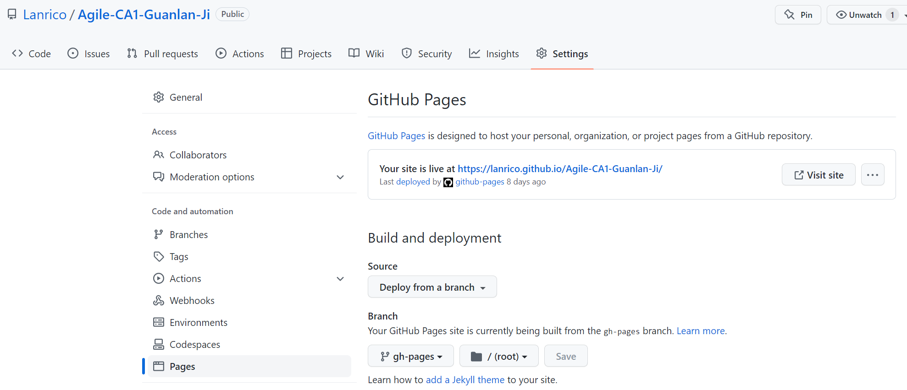

# Assignment 1 - Agile Software Practice.

__Name:__ Guanlan Ji

This repository contains the implementation of a React App and its associated Cypress tests and GitLab CI pipeline.

## React App Features.

[ Provide a bullet-point list of the __new features__ you added to the Movies Fan app (and any modifications to existing features).]
 
+ People page
+ Person detail page
+ A better way to show person's known for movies - dialogs
+ Routing: several parameterized URL for people/person detail page, and each pagination.
+ Several data hyperlinking for people
+ Trending movies and people for day and week, and vote shows by stars
+ authentication and 3rd-party authentication (Firebase)
+ Pagination
+ Responsive UI for most new views
+ Improve the way that the posters of movies and people shows.
+ New MUI components: Material Icons, Rating, Pagination, Paper, Toolbar, Table, Tab

## Setup requirements (run the command before npm start)

npm install firebase

## Related links

+ Github: https://github.com/Lanrico/Agile-CA1-Guanlan-Ji
+ Gitlab: https://gitlab.com/Lanric0/agile-ca1-ci
+ Youtube video: https://www.youtube.com/watch?v=gyUPbHF2MzE
+ Auto Deployment: https://lanrico.github.io/Agile-CA1-Guanlan-Ji/

## Automated Tests.

### Best test cases.

[ State the pathnames of the __two__ (only) test file that best represents your knowledge and understanding of Cypress testing code.]

+ cypress/e2e/people.cy.js
+ cypress/e2e/pagination.cy.js

### Cypress Custom commands.

[ Specify the test file(s) that use a custom Cypress command(s) that you implemented.]

+ cypress/e2e/login.cy.js
+ cypress/e2e/people.cy.js
+ cypress/component/login.cy.js

## Code Splitting.

[Specify the pathname of each the file that contains evidence of code splitting in your React app.]

+ src/components/personDetails/index.js
+ src/pages/movieDetailsPage.js
+ src/pages/movieReviewPage.js

## Pull Requests.

[ Specify the URL of the GitHub repository that contains a record of Pull Requests for the React App.]

https://github.com/Lanrico/Agile-CA1-Guanlan-Ji

## Independent learning.

[ Briefly explain the work you did to satisfy the requirements of the Outstanding grade category, and include proof (e.g. screenshots) of its success. Also, mention the files that contain evidence of this work.

State any other evidence of independent learning achieved while completing this assignment.

### Component test.

Several component tests are included in this repository, as it shows in the screenshots below. 

Related files:
+ cypress/component/login.cy.js
+ cypress/component/ratingBar.cy.js
+ cypress/component/spinner.cy.js
+ cypress/support/component.cy.js
+ cypress/support/component-index.html

### Auto-deployment.

This Movie App is deployment in the github, and the url is https://lanrico.github.io/Agile-CA1-Guanlan-Ji/ . The url can be visited anytime to use this Movie App.

